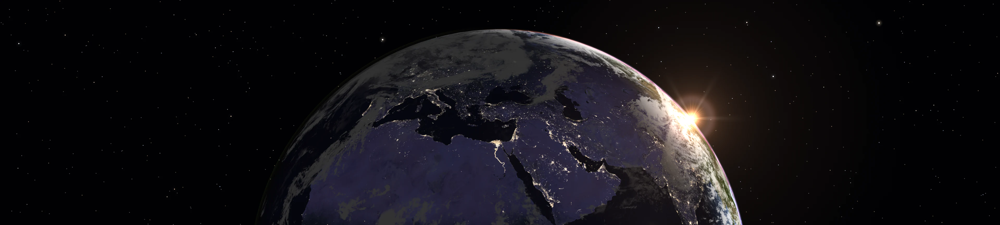
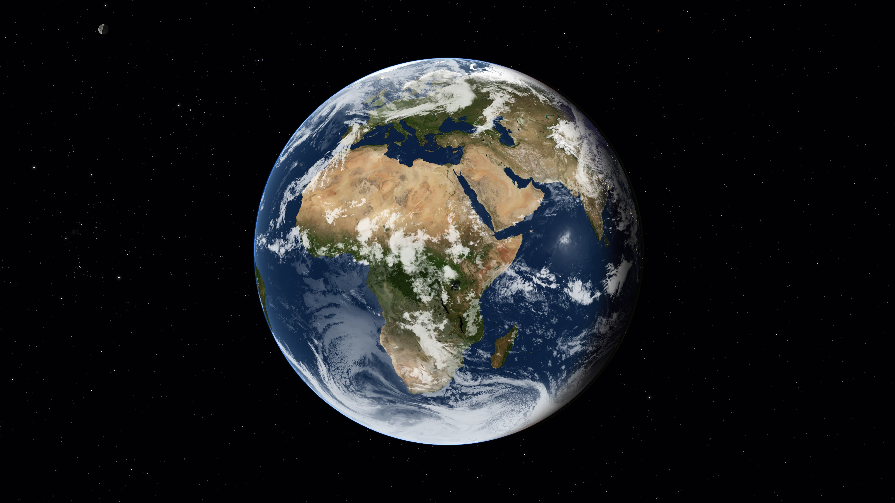
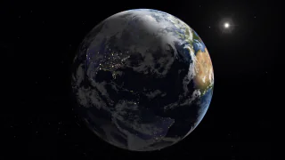
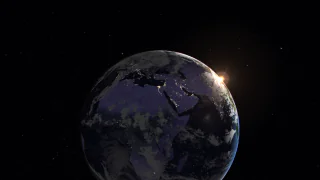
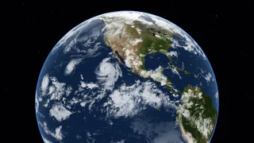
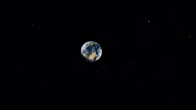
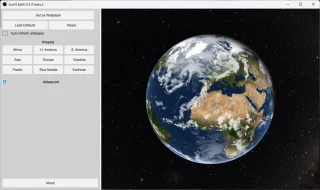
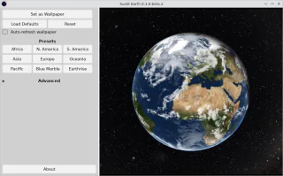

# Sunlit Earth

[](#downloads)
[](LICENSE)
[](https://github.com/sunlit-earth/sunlit-earth/releases)

Sunlit Earth is a free and open source desktop application that renders a beautiful view of Earth as seen from space and sets it as your wallpaper. The rendered image updates in the background, reflecting the current time of day, cloud cover, the positions of the Sun, Moon, and stars, and other real-world conditions.

I built this application as an alternative to [DesktopEarth](https://web.archive.org/web/20221006113849/http://www.anka.me/desktopearth.aspx) and [Xplanet](https://xplanet.sourceforge.net/), both of which I used for years, but they seem to be abandoned now. Sunlit Earth is an attempt to rebuild the ideas of these projects with modern technologies and package them in an application that is easy to use.

[Download](https://github.com/sunlit-earth/sunlit-earth/releases) · [Getting started](#getting-started) · [Using the app](#using-the-app) · [Troubleshooting](#troubleshooting) · [Build from source](#build-from-source)

## Screenshots

[](docs/images/wallpaper-day.webp)

<p>
  <a href="https://raw.githubusercontent.com/sunlit-earth/sunlit-earth/refs/heads/main/docs/images/wallpaper-night.webp"></a>
  <a href="https://raw.githubusercontent.com/sunlit-earth/sunlit-earth/refs/heads/main/docs/images/wallpaper-sunrise.webp"></a>
  <a href="https://raw.githubusercontent.com/sunlit-earth/sunlit-earth/refs/heads/main/docs/images/wallpaper-weather.webp"></a>
  <a href="https://raw.githubusercontent.com/sunlit-earth/sunlit-earth/refs/heads/main/docs/images/wallpaper-ultrawide.webp"></a>
  <a href="https://raw.githubusercontent.com/sunlit-earth/sunlit-earth/refs/heads/main/docs/images/wallpaper-earthrise-photo.webp"></a>
  <a href="https://raw.githubusercontent.com/sunlit-earth/sunlit-earth/refs/heads/main/docs/images/screenshot-windows.webp"></a>
  <a href="https://raw.githubusercontent.com/sunlit-earth/sunlit-earth/refs/heads/main/docs/images/screenshot-linux.webp"></a>
</p>

## Features

- 📸 Custom camera controls and presets let you choose your view of Earth.
- 🌍 Sunlight and city lights reflect the current date and time, with automatic wallpaper updates throughout the day.
- ⛅️ Recent satellite cloud imagery shows changing weather patterns on top of detailed NASA surface textures.
- 🌌 The Sun, Moon, planets, visible stars, and Milky Way are rendered at their astronomically correct positions.
- 🖥 Wallpapers fit your monitor layout, with support for mirrored views or continuous panoramas.
- ⚙️ Everything is adjustable: camera position, lighting, atmospheric effects, apparent size and brightness of celestial objects, etc.

Planned features:

- 🍎 Support for macOS (Apple makes it really hard to test stuff if you don't own Apple hardware...)
- 🔧 More setup options and autostart.
- ❄️ Seasonal surface textures for Earth.
- 🌑 Eclipse rendering (see the moon's shadow moving over the surface of Earth).

## Downloads

> ⚠️ Sunlit Earth is in public beta. You might experience bugs or other things that don't work as they're supposed to. I've been dogfooding Sunlit Earth for months now and I'm confident it won't do something bad on your system, but you never know. If that's not your cup of tea, please hang on until there is a stable release.

At the moment we only have portable binary releases for Linux and Windows on x86-64:

- Linux: [sunlit-earth-0.1.0-linux.tar.gz](https://github.com/sunlit-earth/sunlit-earth/releases/download/v0.1.0/sunlit-earth-0.1.0-linux.tar.gz)
- Windows: [sunlit-earth-0.1.0-windows.zip](https://github.com/sunlit-earth/sunlit-earth/releases/download/v0.1.0/sunlit-earth-0.1.0-windows.zip)
- macOS: coming soon

A macOS release, ARM64 support, and more installation options are all on the roadmap.

The Linux version was tested on KDE, GNOME, Xfce, Cinnamon, and should work on many other desktop environments. The Windows version was tested on a recent version of Windows 11; it'll probably run on older Windows versions, but no guarantees.

On Windows, unpack the zip file and launch `sunlit-earth.exe`. You might get a scary blue warning popup from Microsoft SmartScreen where you have to allow starting the app; sorry, nothing I can do about that at the moment. On Linux, unpack the archive and launch `sunlit-earth` directly (if your desktop environment can do that) or open a terminal in the extracted folder and run `./sunlit-earth`.

If you know your way around the Rust toolchain, you can [build Sunlit Earth from source](#build-from-source) instead.

## Getting started

Sunlit Earth is controlled through the UI, and all components have tooltips. To get started:

1. Open Sunlit Earth and wait for the surface textures to load (takes a few seconds on first launch).
2. Choose a preset or drag the globe to adjust the view to your liking.
3. Click **Set as Wallpaper** to apply the scene as your desktop background.
4. Enable **Auto-refresh wallpaper** if you want the wallpaper to keep updating in the background.
5. You can close the window now, the app will minimize to tray. To terminate the app, right click on the tray icon and exit.

The desktop shows a still image between updates. The preview lets you compose the next scene; click Set as Wallpaper when you want to apply your changes immediately.

Cloud imagery downloads automatically and is cached for later use. Internet access is needed to obtain fresh clouds. The bundled surface textures and astronomical calculations work offline. Clouds are recent imagery (usually less than 3 hours old).

The default globe texture resolution is 4096 pixels wide. Under Advanced → Rendering, choose 2048 to reduce memory use or 8192 for more surface detail. This setting also selects the cloud download resolution. Rendering happens on the GPU by default. If your device does not have a supported GPU or video driver, Sunlit Earth falls back to software rendering, which is slower, but renders at a similar quality level.

## Using the app

### Adjust the view

- Drag with the left mouse button: Move around the globe.
- Scroll: Zoom in or out.
- Drag with the right mouse button: Move the image within the frame.
- Drag with the middle mouse button: Change camera view direction.
- Drag with both left and right buttons: Rotate the camera.

Presets provide starting views. Open **Advanced** for precise camera and framing controls, a date and time override, and adjustments to clouds, celestial objects, atmosphere, lighting, and more.

### Save or restore settings

**Set as Wallpaper** saves the current settings. Changes to automatic refresh and the display plan also save settings. Reset reloads the last saved configuration; Load Defaults restores the app's default values in the window. Click Set as Wallpaper to save and apply the restored view.

Configuration, caches, and generated wallpapers live under these directories:

- Linux: `~/.local/share/SunlitEarth`
- Windows: `%LOCALAPPDATA%\SunlitEarth`
- macOS: `~/Library/Application Support/SunlitEarth`

The settings file is `config.toml`. Back it up if you want to keep a configuration before experimenting.

### Export an image

Render a PNG without opening the settings window:

```bash
sunlit-earth render --output earth.png --width 3840 --height 2160
```

This uses your saved configuration. On Windows, use `sunlit-earth.exe`; on Linux, use `./sunlit-earth` when running from its folder. Run `sunlit-earth --help` or `sunlit-earth render --help` for available options. Note that the exported image will not necessarily match your preview exactly, because it will be rendered at your specified resolution and not the preview window's resolution.

## Troubleshooting

- The globe is a grid instead of an Earth image: Check that the complete archive was extracted and the `textures/` folder is next to the sunlit-earth binary.
- Rendering is slow or memory use is high: Lower texture resolution under Advanced → Rendering. If you have a GPU, make sure your graphics driver is up to date.
- Rendering fails on the GPU: Try launching with `--software-rendering`.
- Clouds are missing or outdated: Check connectivity. Existing cached imagery may remain visible until a fresh download succeeds.
- The wallpaper does not update automatically: Enable Auto-refresh wallpaper and keep the app running. Check the status line for errors or unsupported desktop features.
- There is no tray icon: Tray support depends on the desktop session. Launch with `--mode window` to use the app without a tray.
- The wrong screen or layout is used: Check the Displays mode and anchor. Run `sunlit-earth displays` to inspect the detected layout without changing the wallpaper.

For a [bug report](https://github.com/sunlit-earth/sunlit-earth/issues), include the app version from About, your operating system and Linux desktop if applicable, and steps to reproduce your problem. For display problems, include the output of `sunlit-earth displays`. A screenshot can help explain rendering issues.

## Build from source

Install Rust, e.g. with [rustup](https://rustup.rs/), and install [Git LFS](https://git-lfs.com/). The repository's `rust-toolchain.toml` selects the required Rust version automatically. The build also needs a native compiler and libclang for the astronomy library bindings.

### Platform prerequisites

On Debian and friends:

```bash
sudo apt-get install build-essential pkg-config clang libclang-dev \
  libfontconfig-dev libxcb-shape0-dev libxcb-xfixes0-dev libxkbcommon-dev \
  mesa-vulkan-drivers git-lfs
```

On Windows, install Visual Studio Build Tools with the Desktop development with C++ workload, use Rust's MSVC toolchain, and install LLVM. Set `LIBCLANG_PATH` to the folder containing `libclang.dll` if the build cannot find it.

On macOS, install Xcode command line tools. If bindgen cannot locate libclang, set `LIBCLANG_PATH` to the directory containing your Xcode installation's `libclang.dylib`.

### Clone, build, and run

```bash
git lfs install
git clone https://github.com/sunlit-earth/sunlit-earth.git
cd sunlit-earth
git lfs pull
cargo build --release --locked
cargo run --release --locked
```

Git LFS supplies all texture files. The asset preparation tools are not required for an ordinary build.

The executable is written to `target/release/`. Run from the repository root so the textures are available, or supply `--textures-dir` when launching elsewhere.

To render an image from the checkout:

```bash
cargo run --release -- render --output earth.png --width 1920 --height 1080
```

When building through WSL from a Windows checkout, set `CARGO_TARGET_DIR` to a separate directory in the Linux filesystem, such as `$HOME/sunlit-target`, before building.

If the build reports that libclang is missing, check the platform prerequisites above. On Ubuntu and Debian, the required package is `libclang-dev`.

## Development

Sunlit Earth is written in Rust, with wgpu rendering and a Slint UI. The rendering engine can run without a window, which supports image export and automated testing.

- `crates/sunlit-core/`: Rendering, shaders, astronomy, assets, configuration, and the engine.
- `crates/sunlit-app/`: Settings window, tray, command line interface, and application integration. Builds the `sunlit-earth` executable.
- `crates/xtask/`: Asset preparation, VM tooling, and release builds.

Run the standard checks from the repository root:

```bash
cargo test --workspace
cargo clippy --workspace --all-targets
cargo fmt --check
```

`cargo unit` runs just the unit tests. The full suite includes GPU tests and image comparisons that need the appropriate rendering adapter. Desktop tests run separately with `cargo e2e` on an interactive desktop or through `cargo xtask e2e` in a configured VM.

More information can be found in the [docs folder](docs/README.md). The [VM guide](docs/vm-setup.md) covers desktop test environments and complete release bundles through `cargo xtask dist`.

## AI disclaimer

Most of the code in this repo was written with the help of AI tools. Sunlit Earth is my pet project, and while I've invested a lot of time in it, I wouldn't have been able to get it to a state where I feel comfortable sharing it publicly without these tools that make me question if "programmer" will still be a job soon.

Should you trust the code if most of it was written by a machine? That's up to you. I trust my workflow and review and testing enough that I run the code on my own devices. I'm just sharing this here so you know and can choose for yourself.

I'm also sharing the outcome of conversations with AI agents that resulted in the code you can see in this repo; check out the [docs folder](./docs) to learn more.

## License and credits

Sunlit Earth is free software, distributed under the terms of the [GPLv3](LICENSE) (or later). It was built with public data, freely licensed imagery and open source libraries. Check out [ATTRIBUTION.md](assets/ATTRIBUTION.md) to learn more.
